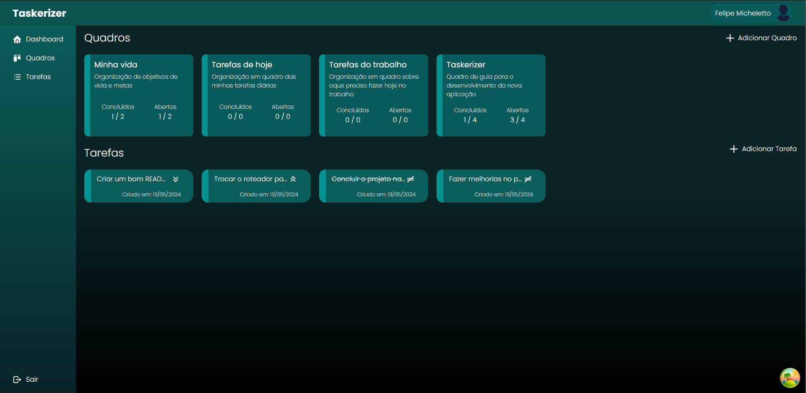
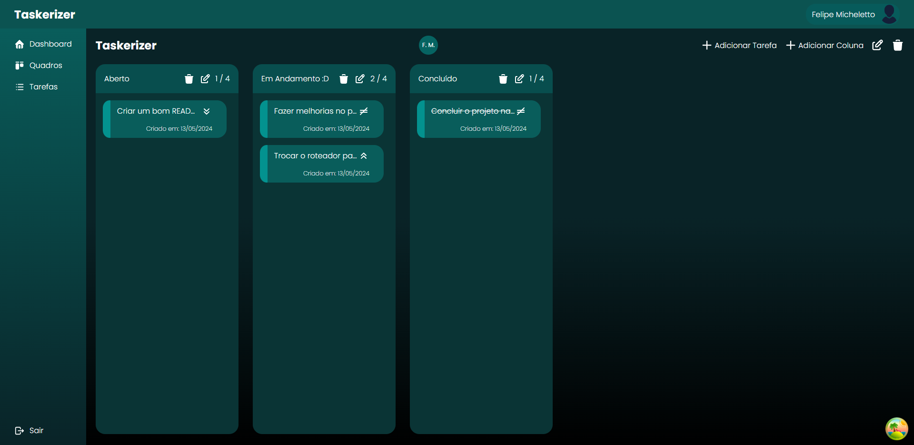

# Taskerizer




Projeto feito para estudos em .NET e React.

O Projeto consiste em uma aplicação de TODO, onde podem ser adicionadas tarefas e quadros 
para ter um auxílio na organização das tarefas. Contando com gerenciamento e compartilhamento de quadros
entre usuários

## 💻 Pré-requisitos

Antes de começar, verifique se você atendeu aos seguintes requisitos:

```
Você instalou a versão mais recente do .NET, Postgres e do Node.JS
```

## 🚀 Instalando Taskerizer

Para instalar o Taskerizer, siga estas etapas:

```
Na pasta raiz:
Execute o comando `dotnet restore`

Na na pasta Todo.UI:
Execute o comando 'npm install' ou 'yarn install'
Crie um arquivo chamado '.env'
Coloque a variavel 'VITE_API_URL' de acordo com o endereço e porta utilizado no dotnet
```

## ☕ Usando o Taskerizer
Para usar Taskerizer, siga estas etapas:

```
Na pasta Todo.API:
Execute o comando 'dotnet run'

Na pasta Todo.UI:
Execute o comando 'npm run dev' ou 'yarn dev' 
```


## 💜 Participantes

<table>
  <tr>
    <td align="center"><a href="https://github.com/fmchtt"><br /><sub><b>Felipe Micheletto</b></sub></a><br /><a href="https://github.com/fmchtt" title="Perfil Felipe">🚀</a></td>
    <td align="center"><a href="https://github.com/ArtCRocha"><br /><sub><b>Arthur Rocha</b></sub></a><br /><a href="https://github.com/ArtCRocha" title="Perfil Arthur">👨🏻‍💻</a></td>
  </tr>
</table>